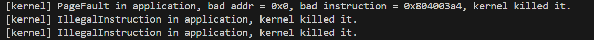

## 简单总结你实现的功能（200字以内，不要贴代码）

为了实现 sys_task_info 系统调用，首先在 TaskManager 中为任务控制块 (TCB) 扩展结构体，加入如下字段：sys_call_times:[u32;MAX_SYSCALL_NUM]，然后在在mod.rs中增加increase_sys_call和get_sys_call_times函数，进而在syscall函数中调用increase_sys_call函数，

在系统调用处理逻辑中，维护当前任务的系统调用次数计数，每次进入系统调用时在数组中相应位置加一。在 sys_task_info 系统调用实现中，将当前任务的状态（应为 Running）、系统调用次数、以及通过 get_time() 获取的任务总运行时间写入 TaskInfo 结构体。

## 简答作业

1. 正确进入 U 态后，程序的特征还应有：使用 S 态特权指令，访问 S 态寄存器后会报错。 请同学们可以自行测试这些内容（运行 [三个 bad 测例 (ch2b_bad_*.rs)](https://github.com/LearningOS/rCore-Tutorial-Test-2024A/tree/master/src/bin) ）， 描述程序出错行为，同时注意注明你使用的 sbi 及其版本。

	- 在TaskControlBlock模块中增加sys_call_times：[u32;MAX_SYSCALL_NUM]，这是系统调用的最大数量。
	- 在TaskManager中增加方法来实现运行时间的增加以及获取当前已经运行的时间。
	- 在syscall函数中调用增加运行时间的函数，并传入syscall_id。
	- 在sys_task_info中，通过 *_ti 解引用指针，并将其赋值为一个新的 TaskInfo 结构体。状态：status 被设为 TaskStatus::Running，表示当前任务处于运行状态；系统调用次数：通过调用 get_sys_call_times() 获取当前任务的系统调用计数。这里假设该函数返回一个包含系统调用次数的数组；时间：通过调用 get_time_ms() 获取当前时间（以毫秒为单位），表示从任务开始调度到现在的总时间。

    
2. 深入理解 [trap.S](https://github.com/LearningOS/rCore-Camp-Code-2024A/blob/ch3/os/src/trap/trap.S) 中两个函数 `__alltraps` 和 `__restore` 的作用，并回答如下问题:
    
    1. L40：刚进入 `__restore` 时，`a0` 代表了什么值。请指出 `__restore` 的两种使用情景。
	
	```
		ch2b_bad_address.rs 由于除0错误触发异常退出
		ch2b_bad_instructions.rs 在用户态非法使用指令sret
		ch2b_bad_register.rs 在用户态非法使用指令csrr
	```
		版本:[rustsbi] RustSBI version 0.3.0-alpha.2
		
    2. L43-L48：这几行汇编代码特殊处理了哪些寄存器？这些寄存器的的值对于进入用户态有何意义？请分别解释。
		```
	    ld t0, 32*8(sp) # 内核栈 32*8(sp) 处存储了原 sstatus 寄存器的值, 将其读取到 t0
		ld t1, 33*8(sp) # 内核栈 32*8(sp) 处存储了原 sepc 寄存器的值, 将其读取到 t1
		ld t2, 2*8(sp) # 内核栈 32*8(sp) 处存储了原 sscratch 寄存器的值, 将其读取到 t2
		csrw sstatus, t0 # 将 t0中原 sstatus 寄存器的值读取到 sstatus
		csrw sepc, t1 # 将 t0中原 sepc 寄存器的值读取到 sepc
		csrw sscratch, t2 # 将 t0中原 sscratch 寄存器的值读取到 sscratch
		```
        
        
    3. L50-L56：为何跳过了 `x2` 和 `x4`？
		```
        ld x1, 1*8(sp)
        ld x3, 3*8(sp)
        .set n, 5
        .rept 27
           LOAD_GP %n
           .set n, n+1
        .endr
		```
    
		跳过x2是因为x2对应的用户栈指针保存到了sscratch寄存器, 不需要从内核栈中进行恢复
		跳过x4是因为并没有使用它, 所以无需恢复
		
        
    4. L60：该指令之后，`sp` 和 `sscratch` 中的值分别有什么意义？
		```
        csrrw sp, sscratch, sp
		```
		sp指向用户栈, sscratch指向内核栈
		
    5. `__restore`：中发生状态切换在哪一条指令？为何该指令执行之后会进入用户态？
        sret后发生了状态切换, 执行该指令后, PC设置为 sepc 寄存器的值。sepc 存储着产生中断或异常前的指令地址，因此这实现了到原始代码的返回。
        
    6. L13：该指令之后，`sp` 和 `sscratch` 中的值分别有什么意义？
        
		```
        csrrw sp, sscratch, sp
		```
		sp, sscratch寄存器的内容被交换, sp保存了原sscratch中的内核栈指针, sscratch保存了原sp中的用户栈栈指针
        
    7. 从 U 态进入 S 态是哪一条指令发生的？
		ecall指令

## 荣誉准则
1. 在完成本次实验的过程（含此前学习的过程）中，我曾分别与以下各位就（与本次实验相关的）以下方面做过交流，还在代码中对应的位置以注释形式记录了具体的交流对象及内容：
	   《你交流的对象说明》

2. 此外，我也参考了 以下资料 ，还在代码中对应的位置以注释形式记录了具体的参考来源及内容：
		[rCore-Tutorial-Book-v3 3.6.0-alpha.1 文档 (rcore-os.cn)](https://rcore-os.cn/rCore-Tutorial-Book-v3/)

3. 我独立完成了本次实验除以上方面之外的所有工作，包括代码与文档。 我清楚地知道，从以上方面获得的信息在一定程度上降低了实验难度，可能会影响起评分。

4. 我从未使用过他人的代码，不管是原封不动地复制，还是经过了某些等价转换。 我未曾也不会向他人（含此后各届同学）复制或公开我的实验代码，我有义务妥善保管好它们。 我提交至本实验的评测系统的代码，均无意于破坏或妨碍任何计算机系统的正常运转。 我清楚地知道，以上情况均为本课程纪律所禁止，若违反，对应的实验成绩将按“-100”分计。