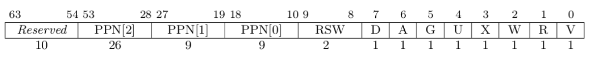

## 简单总结你实现的功能（200字以内，不要贴代码）
- 完成sys_get_time和sys_task_info函数，需要定义一个translated_struct_ptr，它通过页表（PageTable）将一个指向结构体（`*mut T`）的指针翻译为对应的物理地址，并返回一个可变引用（&'static mut T），这样可以直接操作映射后的物理内存。在sys_task_info函数中，需要获取系统调用时间和任务运行时间，所以需要在task.rs中定义并实现它们。
- 完成sys_mmap和sys_munmap函数，用于申请和释放虚拟内存映射。sys_mmap 通过指定的起始地址 start、长度 len 和内存页属性 port 来映射一段物理内存到虚拟地址空间。该函数会检查起始地址对齐情况、port 的合法性，并将内存页映射为可读、可写或可执行。sys_munmap 则用于取消内存映射，释放从 start 开始的一段虚拟内存。（注意，需要判断地址是否对齐）

## 简答作业

1. 请列举 SV39 页表页表项的组成，描述其中的标志位有何作用？
	
	上图为 SV39 分页模式下的页表项，其中[53 : 10]这44位是物理页号，最低的8为[7 : 0]则是标志味，它们的含义如下：
	- 仅当 V(Valid) 位为 1 时，页表项才是合法的；
	- R/W/X 分别控制索引到这个页表项的对应虚拟页面是否允许读/写/取指；
	- U 控制索引到这个页表项的对应虚拟页面是否在 CPU 处于 U 特权级的情况下是否被允许访问；
	- G全局标志位，通常用于内核页表项，避免在上下文切换时刷新全局页表项；
	- A(Accessed) 记录自从页表项上的这一位被清零之后，页表项的对应虚拟页面是否被访问过；
	- D(Dirty) 则记录自从页表项上的这一位被清零之后，页表项的对应虚拟页表是否被修改过。
2. 缺页
    1. 缺页指的是进程访问页面时页面不在页表中或在页表中无效的现象，此时 MMU 将会返回一个中断， 告知 os 进程内存访问出了问题。os 选择填补页表并重新执行异常指令或者杀死进程。
	    - 请问哪些异常可能是缺页导致的？
		    访问了一个没有映射的虚拟地址；
		    访问了映射了虚拟地址但尚未加载到物理内存的页面；
		    访问违反了权限的页面，如对只读页面进行写操作；
		- 发生缺页时，描述相关重要寄存器的值，上次实验描述过的可以简略。
			stap寄存器：存储当前进程的页表基地址和页表模式；
			stval寄存器：保存引起异常的虚拟地址；
			spec寄存器：保存发生缺页异常时的程序计数器PC；
			scause寄存器：保存了引起异常的原因；
		
    2. 缺页有两个常见的原因，其一是 Lazy 策略，也就是直到内存页面被访问才实际进行页表操作。 比如，一个程序被执行时，进程的代码段理论上需要从磁盘加载到内存。但是 os 并不会马上这样做， 而是会保存 .text 段在磁盘的位置信息，在这些代码第一次被执行时才完成从磁盘的加载操作。
	    - 这样做有哪些好处？
		    提高内存利用率：通过延迟加载，系统只会为真正被访问的页面分配内存，避免了不必要的内存占用。这样可以在系统中运行更多的进程或者更大规模的程序，而无需一次性将所有的代码段加入到内存。
		    减少I/O操作：Lazy加载可以避免将不会被执行的代码从磁盘中读入内存，这样可以减少磁盘的I/O操作。
	    
        其实，我们的 mmap 也可以采取 Lazy 策略，比如：一个用户进程先后申请了 10G 的内存空间， 然后用了其中 1M 就直接退出了。按照现在的做法，我们显然亏大了，进行了很多没有意义的页表操作。
        - 处理 10G 连续的内存页面，对应的 SV39 页表大致占用多少内存 (估算数量级即可)？
			每页大小4k。一级页表 10G / 4k = 2560页表项 = 2560k  * 8 字节；二级页表 2560k / 512(每级页表条目数)=5k 页表项=5k * 8字节；三级页表 5k / 512 =10页表项=10*8字节
			所以，数量级在几M字节。
			
        - 请简单思考如何才能实现 Lazy 策略，缺页时又如何处理？描述合理即可，不需要考虑实现。
	        当用户进程申请内存时，不需要马上为它分配实际的物理内存，也不建立完整的页表映射。可以仅在虚拟地址空间中保留这个地址范围，并用一个空页表项指示该范围还没有分配物理内存。
	        操作系统主动捕获缺页异常，并在页表中为该虚拟地址分配一个物理页面，更新对应的页表项，然后重新执行导致缺页的指令。
        - 此时页面失效如何表现在页表项(PTE)上？
	        页表项的有效位被置为0，这表明当前的虚拟地址还没有映射到实际的物理内存。

        
3. 双页表与单页表
	为了防范侧信道攻击，我们的 os 使用了双页表。但是传统的设计一直是单页表的，也就是说， 用户线程和对应的内核线程共用同一张页表，只不过内核对应的地址只允许在内核态访问。 (备注：这里的单/双的说法仅为自创的通俗说法，并无这个名词概念，详情见 KPTI )
	
	- 在单页表情况下，如何更换页表？
		通过更新 satp寄存器来完成，这个寄存器包含了当前活动页表的物理地址。
	- 单页表情况下，如何控制用户态无法访问内核页面？（tips:看看上一题最后一问）
		内核页表的页表项不设置U位即可
	- 单页表有何优势？（回答合理即可）
		节省内存，上下文切换开销更小，减少TLB的刷新。
	- 双页表实现下，何时需要更换页表？假设你写一个单页表操作系统，你会选择何时更换页表（回答合理即可）？
		在双页表设计下，通常当从用户态切换到内核态时（例如发生系统调用或硬件中断时），会需要切换到内核页表，确保内核内存和内核代码的访问安全。
		
		单页表实现下, 切换不同的进程时才需要切换页表。
## 荣誉准则
1. 在完成本次实验的过程（含此前学习的过程）中，我曾分别与以下各位就（与本次实验相关的）以下方面做过交流，还在代码中对应的位置以注释形式记录了具体的交流对象及内容：
	   《你交流的对象说明》

2. 此外，我也参考了 以下资料 ，还在代码中对应的位置以注释形式记录了具体的参考来源及内容：
		[rCore-Tutorial-Book-v3 3.6.0-alpha.1 文档 (rcore-os.cn)](https://rcore-os.cn/rCore-Tutorial-Book-v3/)

3. 我独立完成了本次实验除以上方面之外的所有工作，包括代码与文档。 我清楚地知道，从以上方面获得的信息在一定程度上降低了实验难度，可能会影响起评分。

4. 我从未使用过他人的代码，不管是原封不动地复制，还是经过了某些等价转换。 我未曾也不会向他人（含此后各届同学）复制或公开我的实验代码，我有义务妥善保管好它们。 我提交至本实验的评测系统的代码，均无意于破坏或妨碍任何计算机系统的正常运转。 我清楚地知道，以上情况均为本课程纪律所禁止，若违反，对应的实验成绩将按“-100”分计。